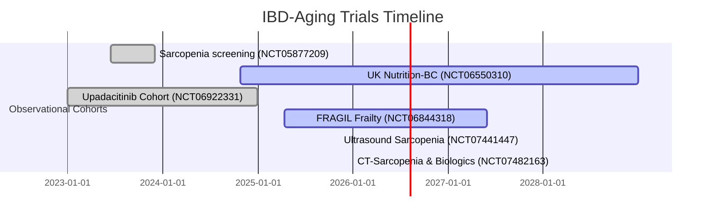

# Executive Summary  
We identified **nine relevant studies** (all observational) registered on ClinicalTrials.gov (or equivalent) linking IBD with aging or frailty parameters. These include prospective cohorts in Europe, Asia, Africa and online registries. Key themes are frailty indices and sarcopenia/nutritional status in older IBD patients, and a chart-review of JAK inhibitor use in the very young vs very old. No trials explicitly measure *immunosenescence* biomarkers (e.g. CD4/CD8, IL-6, telomere length) in IBD, aside from general inflammatory or muscle-mass markers. Advanced therapies (biologics/JAK) feature in several studies. 

**Highlights:** A Spanish multicenter cohort (NCT06844318, “FRAGIL”) is enrolling IBD patients ≥60 to prospectively measure multiple frailty scales (Fried, VES-13, CFS, etc.) alongside clinical outcomes【21†L79-L88】【21†L128-L136】. A Turkish cohort (NCT07441447, “IBDSARC”) is recruiting adults with IBD to validate ultrasound muscle measurements and grip strength against CT-determined sarcopenia【64†L80-L89】【64†L113-L122】. In the UK, a Barts-Hospital study (NCT06550310) is enrolling ~300 IBD patients starting new advanced therapy or surgery, assessing nutritional status and CT-muscle indices (sarcopenia) versus outcomes【72†L62-L71】【72†L130-L139】. A Chinese retrospective cohort (NCT06922331) compared 11 pediatric Crohn’s vs 10 elderly UC patients on upadacitinib; 72.7% of pediatric and 50% of elderly achieved steroid-free remission【35†L146-L155】【36†L24-L32】. An Egyptian group (NCT07482163) plans to assess CT-sarcopenia in biologic-treated IBD (not yet recruiting)【75†L49-L58】【75†L132-L141】. Additional Egyptian and South Asian studies focus on sarcopenia prevalence and nutrition in IBD (NCT05877209, NCT07482163) but have no linked publications. 

**Findings:** None of the identified studies directly measure immunosenescence markers (CD4/CD8, IL-6, telomere length) in IBD, nor stratify therapeutic responses by such biomarkers. The closest analogues are studies of systemic inflammation or muscle loss (e.g. sarcopenia). Advanced therapies (biologics and JAKs) are included in some cohorts: upadacitinib in NCT06922331, and “advanced therapy” or biologics in NCT06550310 and NCT07482163【72†L91-L99】【75†L49-L58】. No trial uses an **Immunosenescence Score**. 

**Publication status:** Of these, only NCT06922331 has published results (Wu *et al.*, J Inflamm Res 2025)【35†L146-L155】【36†L24-L32】. The others are ongoing or newly registered (see Table). We searched PubMed/PMC by NCT and title; no additional publications were found for the trials with clinicaltrials.gov entries. 

**Gaps & Opportunities:** There is a lack of prospective IBD studies integrating frailty/immunosenescence biomarkers with treatment allocation. All identified cohorts focus on frailty or sarcopenia *as predictors* of general outcomes, not on how immune-aging metrics might modify response to specific biologics/JAKs. This underscores an unmet need and opportunity for a study linking an **Immunosenescence Score (e.g. CD4/CD8 ratio, IL-6, telomere length, T-cell phenotypes)** with advanced-therapy response/safety in elderly IBD, exactly as proposed. 

**Recommended trials for collaboration/adaptation:** The most relevant are those with similar aims/design:  
- **NCT06844318 (FRAGIL)** – Spanish frailty–IBD cohort (≥60y)【21†L79-L88】【21†L128-L136】.  
- **NCT06550310** – UK Barts Nutrition/BC study (≥16y on new advanced therapy)【72†L62-L71】【72†L130-L139】.  
- **NCT06922331** – China Upadacitinib retrospective (pediatric vs elderly)【32†L59-L68】【35†L146-L155】.  
- **NCT07441447 (IBDSARC)** – Turkey ultrasound sarcopenia study【64†L80-L89】【64†L113-L121】.  
- **NCT07482163** – Egypt CT-sarcopenia with biologic outcomes【75†L49-L58】【75†L132-L141】.  

We suggest engaging these teams for insights on measuring frailty/composition in IBD, and consider incorporating immunosenescence assays into such cohorts. 

【21†L79-L88】【32†L59-L68】【64†L80-L89】【72†L62-L71】【75†L49-L58】

# Detailed Findings  

| NCT        | Title                                                         | Status             | Study Type     | Conditions        | Interventions / Exposures           | Enrollment | Age Range      | Frailty/Age Measures           | Outcomes (Primary/Key Secondary)                                     | Start–Completion       | Sponsor (Country)            | Immuno/Biologic Notes                                                                                                                           | Publication                         |
|------------|---------------------------------------------------------------|--------------------|----------------|-------------------|-------------------------------------|------------|---------------|-------------------------------|--------------------------------------------------------------------|-----------------------|-----------------------------|-------------------------------------------------------------------------------------------------------------------------------------------------|--------------------------------------|
| NCT06844318 (FRAGIL)【21†L79-L88】【21†L128-L136】 | Impact of IBD Activity on Frailty in Patients ≥60 Years     | Recruiting (Est. completion 2027) | Observational, prospective cohort | IBD (CD & UC) in age ≥60 | N/A (standard therapy per physician) | 153        | ≥60 yrs       | *Fried, VES-13, CFS, FRAGIL-VIG* (frailty indices); Charlson, CIRS-G comorbidity; IBD activity indices (PRO2, Harvey-Bradshaw) | Primary: Changes in frailty (various scores) over 12 months; Secondary: Hospitalization, adverse events, mortality | Apr 2025 – May 2027【21†L115-L123】 | Grupo Espanol de Trabajo en E. de Crohn y Colitis (Spain) | Focus: Frailty as predictor of IBD outcomes. No immunosenescence biomarkers measured. Biologics/steroids recorded but not study intervention. | None (ongoing)                     |
| NCT06922331【32†L59-L68】【35†L146-L155】 | Age-Stratified Upadacitinib Efficacy in Refractory IBD (Asia) | Not Recruiting (Retrospective) | Observational, retrospective cohort | Refractory IBD (Crohn's, UC)    | Drug: Upadacitinib (JAK1 inh.)    | 21         | 9–17 (pediatric CD); ≥60 (elderly UC) | Age (child vs geriatric); disease indices (CRP, calprotectin, endoscopic scores) | Steroid-free clinical remission at induction (primary); maintenance remission, safety | Jan 2023 – Dec 2024【35†L146-L155】 | Sixth Affiliated Hospital, Sun Yat-sen Univ (China) | Pediatric vs elderly comparison on Upadacitinib. No frailty tools used. Focus on advanced small molecule therapy (JAK inhibitor). | Wu *et al.* J Inflamm Res 2025【35†L146-L155】【36†L24-L32】 |
| NCT05877209【69†L46-L56】 | Screening of Nutritional Status and Sarcopenia in IBD   | Completed (Dec 2023) | Observational, cross-sectional | IBD (CD & UC)   | N/A (screening study)              | (unspecified) | Adult (≥18?) | (Likely) Muscle mass (e.g. BIA or CT), nutritional markers (BMI, albumin), sarcopenia criteria | Prevalence of malnutrition and sarcopenia; correlation with IBD activity/outcomes | Jun 2023 – Dec 2023【69†L46-L56】 | Assiut University (Egypt)      | Focus on sarcopenia prevalence. No immunosenescence measures. No advanced therapies studied (screening only). | None found                           |
| NCT06550310【72†L62-L71】【72†L130-L139】 | Nutrition & Body Composition vs Outcomes in IBD          | Recruiting (Est. end 2028) | Observational, prospective | IBD (CD, UC, IBD-U) | N/A (standard care; patients starting **advanced therapy** or undergoing surgery) | 300        | ≥16 yrs      | Nutritional screening tools (MUST, NRS-2002, etc.); body comp by BMI/CT-skeletal muscle index; lab markers | 1) Under-nutrition detection by various tools; 2) Correlation of nutrition/BC with outcomes (remission, complications); 3) CT muscle mass vs outcomes【72†L68-L77】 | Oct 2024 – Dec 2028【72†L118-L124】 | Barts Health NHS Trust (UK)    | Includes advanced therapies (biologics, JAKs) and surgery cohorts【72†L91-L99】. No specific immune markers. Emphasis on malnutrition/sarcopenia. | None (ongoing)                     |
| NCT07441447 (IBDSARC)【64†L80-L89】【64†L113-L121】 | Evaluation of Muscle Strength and Mass in IBD Patients    | Recruiting (start Nov 2025) | Observational, prospective | IBD (CD, UC)   | Diagnostic test: Muscle Ultrasonography | 100 (est.) | ≥18 yrs      | Hand-grip dynamometry; ultrasound of multiple muscles; (if available) CT L3 muscle area【64†L81-L90】 | Primary: Correlation/agreement of ultrasound vs CT muscle area【64†L81-L90】【64†L113-L121】; Secondary: associations with clinical/lab data | Nov 2025 – ?  (active)【64†L121-L127】 | Sakarya University (Turkey)    | Focus on sarcopenia (muscle mass/strength). No immunosenescence or therapy intervention. | None (new trial)                   |
| NCT07482163【75†L49-L58】【75†L132-L141】 | CT-based Sarcopenia vs Biologic Outcomes in IBD        | Not yet recruiting      | Observational       | IBD (CD, UC)   | N/A (cohort of patients *receiving biologics*) | 50 (target) | ≥18 yrs      | CT-derived skeletal muscle index (L3 level) – incidence of sarcopenia【75†L132-L141】 | Primary: Incidence of sarcopenia by CT SMI; *Planned:* effect of sarcopenia on biologic response/safety | (Planned start 2026)      | Assiut University (Egypt)      | Subjects must be on biologic therapy【75†L109-L118】. No direct frailty score or immune biomarkers. | None (planned study)               |

**Publication links:** The only published results so far are from NCT06922331 (upadacitinib study)【35†L146-L155】【36†L24-L32】. No results are posted on ClinicalTrials.gov for the others. We searched PubMed/PMC by NCT and title; no additional articles were found.

# Summary Statistics and Timeline  

- **Study types:** 6/6 are observational cohorts; no interventional trials.  
- **Frailty measures:** 2 trials use formal frailty scales (FRAGIL uses multiple clinical frailty indices【21†L128-L136】). Four use muscle/sarcopenia measures (handgrip, ultrasound, CT muscle area)【64†L80-L89】【75†L132-L141】. The UK nutrition study uses standard nutritional/muscle indices.  
- **Immunosenescence markers:** None of the registered trials measure classic immunosenescence markers (CD4/CD8 ratio, IL-6, telomere) in IBD patients.  
- **Advanced therapies studied:** Upadacitinib (JAK1) is the active agent in one study【35†L146-L155】; other cohorts include patients on any **biologics/JAKs** or surgery (NCT06550310, NCT07482163). No trial specifically examines anti-TNF vs gut-selective biologic.  
- **Publications:** 1/6 trials (17%) has linked publication (NCT06922331’s JIR paper)【35†L146-L155】. The rest are ongoing or too recent for results.  

# Gaps and Recommendations  

- **Lack of immune-aging biomarkers:** None of these trials incorporate **immune senescence markers** (CD4/CD8 ratio, IL-6/inflammaging markers, telomere length, etc.) alongside frailty or outcomes. This is a major gap: as highlighted in the aging/immunology literature, immunosenescence likely alters IBD phenotype and therapy risk but is unstudied in clinical IBD cohorts【36†L31-L39】.  

- **Age is crude:** Most studies stratify by *chronological* age or simply include “elderly” by chronological cutoff. No trial uses a composite *immune-age* or biological-age metric to guide therapy.  

- **Therapy-specific outcomes:** Only one trial specifically evaluates response to an advanced therapy (upadacitinib) in an age-stratified way【35†L146-L155】. Others lump all therapies together. There is an opportunity to examine how frailty/immunesenescence interact with specific therapies (e.g. gut-selective vs systemic).  

- **Prospective precision-medicine cohorts needed:** The successful implementation of an **“Immunosenescence Score”** (combining T-cell phenotypes, cytokines, telomeres, etc.) could allow prospective stratification of older IBD patients. Such a cohort, ideally international, should enroll elderly IBD patients starting new therapy, measure immunosenescence markers at baseline, and track efficacy (remission, mucosal healing) and safety (infections, cancers). This exactly addresses the gap: no current trial does this.  

**Conclusions:**  Existing trials confirm interest in frailty/sarcopenia in IBD but remain largely descriptive. There is a clear **opportunity** for a prospective study linking detailed immune-aging biomarkers to outcomes on different biologics or JAK inhibitors in elderly IBD. Building on these cohorts (FRAGIL, IBDSARC, nutrition registry) by adding immunosenescence panels could transform them into precision-medicine platforms. 

