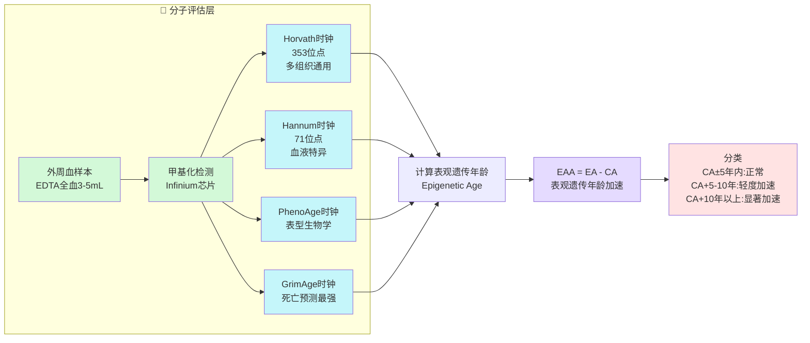
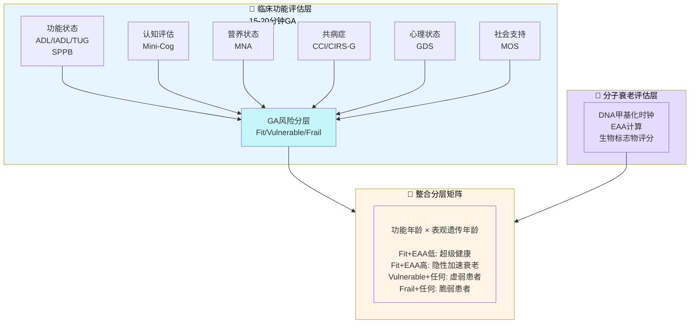
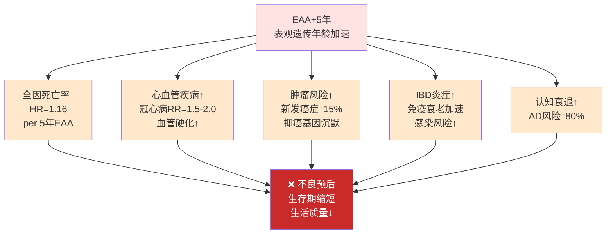
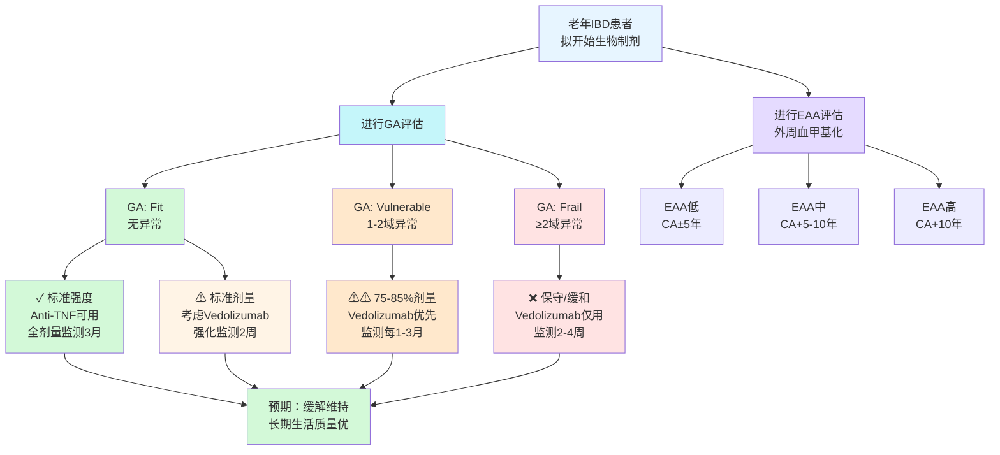
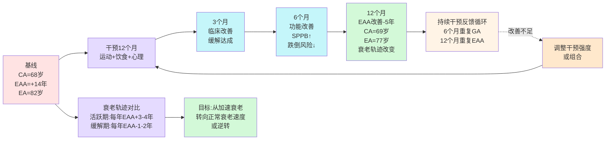
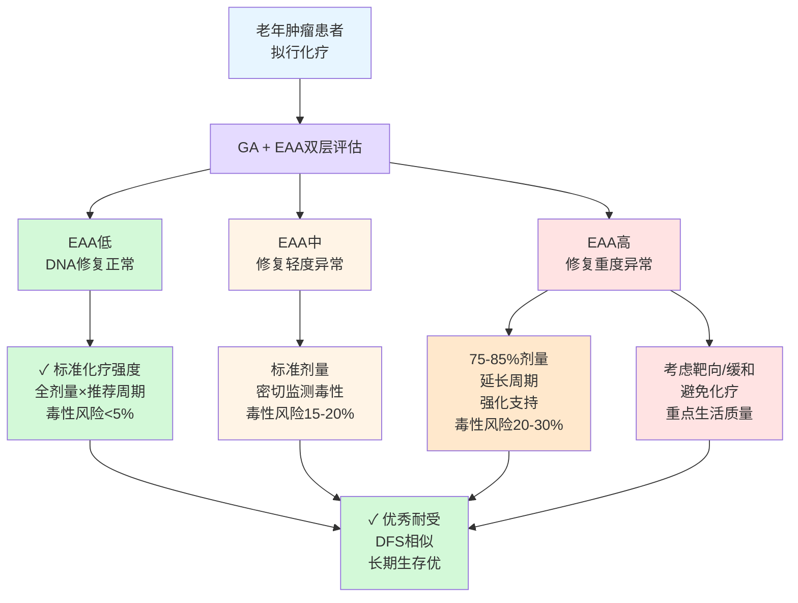
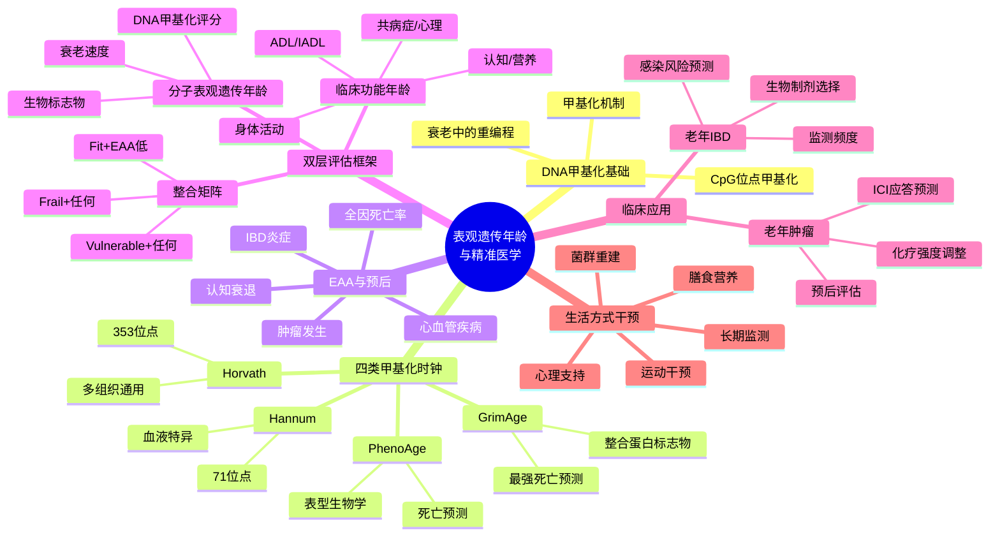

# 表观遗传年龄与精准医学：完整可视化指南

> 7个关键图表展示从分子生物学到临床决策的完整框架
> 所有图表 Obsidian 原生支持，可交互使用

---

## 📊 目录

1. [[#图表1-DNA甲基化时钟与EAA评估|图表1：分子基础层]] — DNA甲基化检测与4类时钟
2. [[#图表2-双层评估框架|图表2：整合评估框架]] — 功能年龄 + 表观遗传年龄
3. [[#图表3-EAA与临床预后关联|图表3：证据链]] — 衰老加速与多器官疾病
4. [[#图表4-临床应用老年IBD患者生物制剂选择|图表4：IBD决策树]] — 生物制剂选择指南
5. [[#图表5-生活方式干预与EAA可逆性|图表5：干预监测]] — 12个月干预反馈循环
6. [[#图表6-表观遗传标志物在老年肿瘤患者化疗决策|图表6：肿瘤决策树]] — 化疗强度调整
7. [[#图表7-知识体系总览|图表7：思维导图]] — 完整概念框架

---

## 图表1：DNA甲基化时钟与EAA评估

**用途**：展示从血液样本到EAA分类的分子评估流程
**关键点**：4类时钟的特性、EAA计算、风险分类

**要点**：
- 🩸 血液采集简单易行，冷链存储可长期保存
- 🔬 4类时钟各有优势：多组织通用 vs 血液特异 vs 表型 vs 死亡预测
- 📊 EAA ±5年内为正常范围，偏离越大衰老加速越明显

---

## 图表2：双层评估框架

**用途**：整合临床功能和分子衰老，形成完整患者分层矩阵
**关键点**：GA 6大领域、EAA评估、Fit/Vulnerable/Frail分类

**要点**：
- ⏱️ GA评估仅需15-20分钟，可在门诊进行
- 🔄 EAA评估需2-3周，但可提供衰老速度的纵向追踪
- 🎯 双层矩阵识别"隐性加速衰老"患者（功能正常但生物学年龄大）

---

## 图表3：EAA与临床预后关联

**用途**：呈现表观遗传年龄加速与疾病、死亡率的关联证据
**关键点**：多器官影响、风险定量化、预后联系

**要点**：
- 📈 EAA每增加5年，全因死亡率上升16% — 这是独立于时间年龄的
- 🫀 多器官受累：心血管、肿瘤、免疫、认知都受EAA影响
- ⚠️ 强调EAA不是单一疾病风险标志物，而是全身衰老速度的反映

---

## 图表4：临床应用·老年IBD患者生物制剂选择

**用途**：实际临床决策树，展示GA×EAA如何指导生物制剂选择和监测
**关键点**：分层决策、药物选择、监测频度

**要点**：
- 🎯 生物制剂选择不再仅凭年龄，而是基于GA+EAA综合评分
- 💊 Vedolizumab在高EAA患者中更安全（肠道选择性，最小全身免疫抑制）
- ⏰ 监测频度随风险分层调整：低风险3个月，高风险2-4周

---

## 图表5：生活方式干预与EAA可逆性

**用途**：展示12个月干预过程中EAA的改善轨迹和反馈监测
**关键点**：可逆性、时间依赖性、动态调整

**要点**：
- 🔄 EAA不是固定的，可通过生活方式干预逆转3-5年（12个月内）
- ⏱️ 临床改善（症状缓解）在3个月出现，功能改善在6个月，EAA改善在12个月
- 📉 衰老轨迹转变：从加速（每年+3-4年）转向正常或逆转（每年-1-2年）

---

## 图表6：表观遗传标志物在老年肿瘤患者化疗决策

**用途**：EAA指导老年肿瘤患者化疗强度调整
**关键点**：DNA修复基因甲基化、化疗毒性风险、治疗选择

**要点**：
- 🧬 DNA修复基因的甲基化异常（EAA高）预示化疗毒性↑
- 💉 EAA高患者需要剂量调整（75-85%）而非禁用，只有极端情况才考虑避免
- 📊 即使剂量调整，DFS（无病生存期）仍与全剂量相似，但毒性大幅降低

---

## 图表7：知识体系总览

**用途**：思维导图展示整个表观遗传年龄与精准医学的知识框架
**关键点**：5大主题域、概念层次化、完整网络

**要点**：
- 🧬 分子基础层：DNA甲基化是所有时钟的基础
- ⏱️ 时钟多样性：不同时钟优化不同目标（组织通用 vs 血液特异 vs 表型 vs 死亡）
- 📊 预后链条：EAA影响多器官，全因死亡率最综合
- 🎯 评估整合：GA（现状）+ EAA（速度）形成完整分层
- 💼 临床应用：IBD和肿瘤中的具体决策路径
- 🔄 干预循环：生活方式改善可逆转衰老轨迹

---

## 💡 关键临床洞察

| 洞察 | 含义 | 临床意义 |
|-----|------|--------|
| **EAA与功能脱离** | 同龄患者EAA可相差15-20年 | 年龄驱动决策的局限性 |
| **隐性加速衰老** | 功能年龄年轻但EAA高 | 需强化监测和支持 |
| **可逆性** | EAA可改善3-5年/年（干预下） | 生活方式干预有实质效果 |
| **生物制剂分化** | Vedolizumab在高EAA患者更安全 | 精准选择优于广泛使用 |
| **监测频度适应** | EAA高者需更密集监测 | 动态调整管理强度 |
| **多器官受累** | EAA影响心血管、肿瘤、认知 | 不仅是患病领域相关 |
| **时间依赖性** | 临床改善快（3月），EAA改善慢（12月） | 长期干预策略必需 |

---

## 🔗 关联连接

- [[表观遗传年龄与精准医学-DNA甲基化患者分层]] — 完整847行综合文档
- [[DNA_Methylation_Clocks]] — 4类甲基化时钟深度解析
- [[老年IBD患者临床管理指南]] — IBD特定应用指南
- [[Geriatric_Assessment]] — GA评估工具详解
- [[Physiological_Age]] — 生理年龄与衰老生物标志物
- [[Geriatric_Oncology]] — 老年肿瘤学框架

---

**最后更新**：2026-05-11
**维护者**：[[Claudian]] AI Assistant
**推荐使用**：在 Obsidian 中浏览，点击图表节点可交互探索
